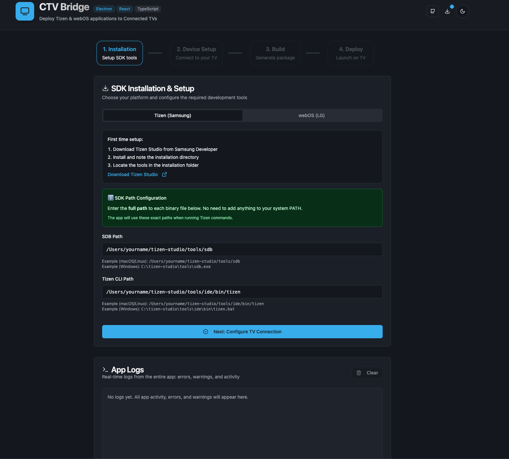
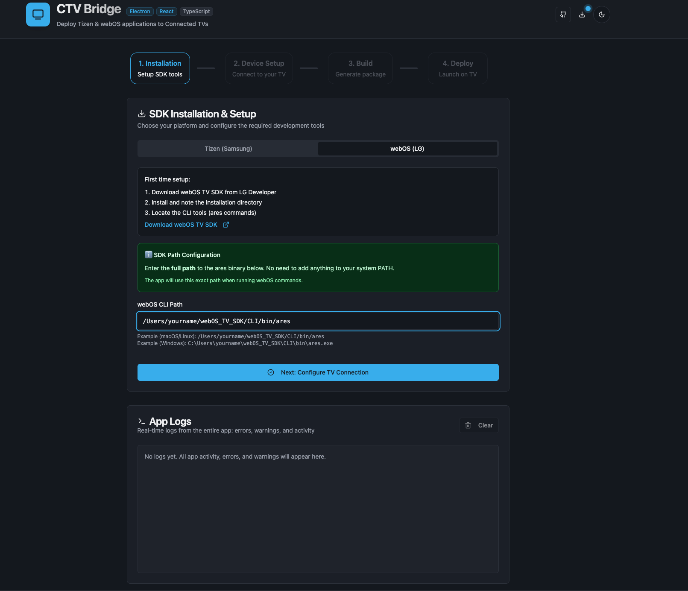
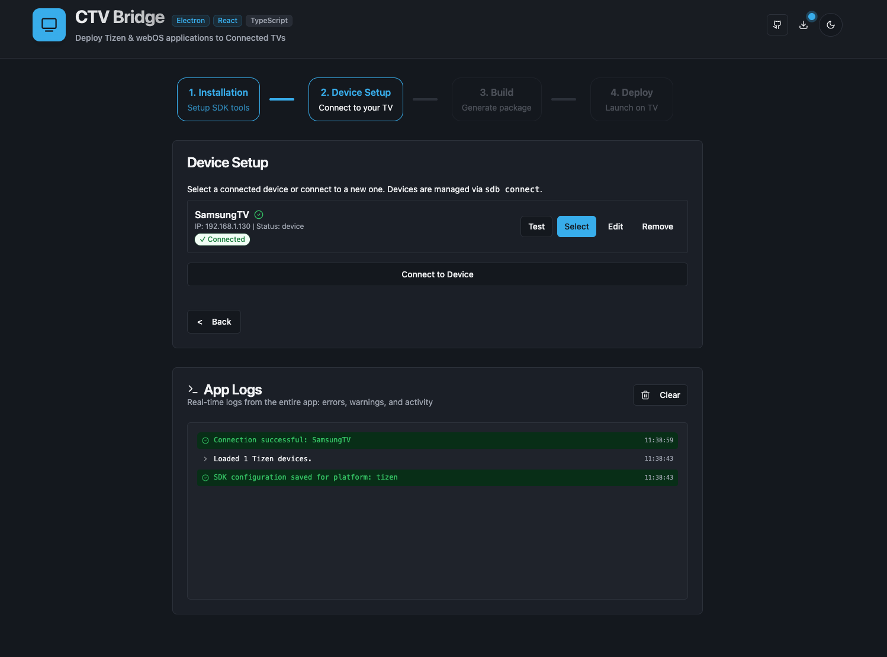
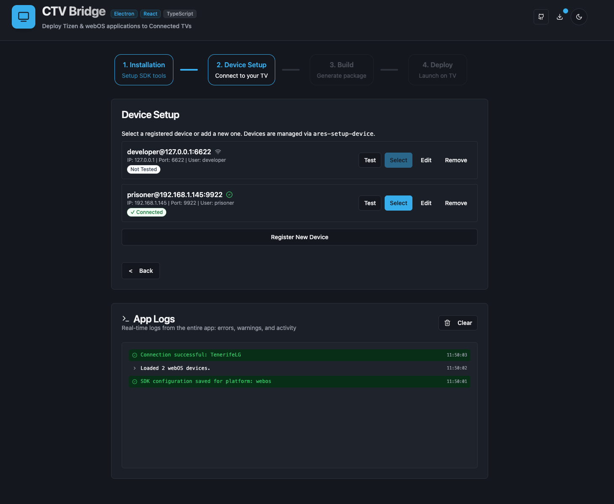
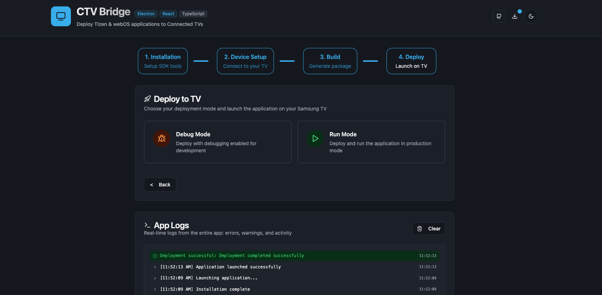
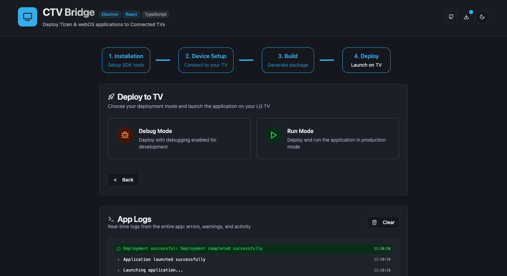

# CTV Bridge


**CTV Bridge is an open-source desktop tool that simplifies deploying and debugging Connected TV applications directly on real Samsung Tizen, LG webOS, and Android TV devices.**

## Why CTV Bridge exists

Developing for Connected TVs often means dealing with fragmented tooling, repetitive CLI commands,
and fragile deployment workflows that slow down iteration and testing.

CTV Bridge was created to reduce that friction by providing a single, unified interface on top of
the official Tizen, webOS, and Android tooling, without reinventing or replacing vendor SDKs.

---

## High-level architecture

CTV Bridge acts as a thin UI layer on top of official vendor CLIs (Tizen, webOS, Android),
handling command orchestration, device management and log aggregation,
while keeping all execution local to the developer machine.

---

## 🚀 Key Features

### 📺 Multi-Platform Support

- **Samsung Tizen**: Seamless integration with Tizen Studio CLI (`sdb`, `tizen`).
- **LG webOS**: Full support for webOS OSE/TV CLI (`ares-*` tools).
- **Android TV**: Integration with Android Debug Bridge (`adb`) for APK deployment on Android TV / Fire TV.

### ⚡ One-Click Deployment

- **Automated Build**: Generate `.wgt`, `.ipk`, and `.apk` packages instantly.
- **Smart Install**: Automatically handles uninstallation of old versions and installation of new packages.
- **Instant Launch**: Apps launch immediately after deployment.

### 🛠️ Advanced Debugging

- **webOS Inspector**: Integrated support for `ares-inspect`. Automatically captures and displays the Chrome DevTools URL for instant debugging.
- **Live Logs**: View real-time deployment logs and error messages directly in the UI.

### 🔌 Device Management

- **Unified Dashboard**: Manage all your Tizen, webOS, and Android devices in one place.
- **Connection Doctor**: Built-in troubleshooting for SSH keys and connection issues.

---

## Who is this for?

CTV Bridge is designed for:

- CTV / Smart TV developers
- Frontend engineers working with Tizen, webOS, or Android TV
- QA engineers testing apps on real TV devices
- Teams building OTT / streaming applications

---

## 📸 Visual Walkthrough

### 1. Easy SDK Configuration

Configure your Tizen, webOS, and Android SDK paths directly in the app. No system PATH modification required.

<p align="center">
  
  
</p>

### 2. Unified Device Management

Manage all your TVs in one place. Add devices by IP, manage SSH keys for webOS, and test connections instantly.

<p align="center">
  
  
</p>

### 3. One-Click Deployment

Build, install, and launch your app in seconds. Toggle **Debug Mode** to automatically launch the Web Inspector.

<p align="center">
  
  
</p>

---

## 🚀 Getting Started

1. **Download** the latest release from the [GitHub releases page](https://github.com/Braggiouy/ctv-bridge/releases/latest).
2. **Install** the app for your OS (macOS `.dmg`/`.zip`, Windows `.exe`, Linux `.AppImage`/`.deb`).
3. **Run CTV Bridge** and select your platform (Tizen, webOS, or Android).
4. **Add a device**:
   - _Tizen_: Enter the TV's IP address (Developer Mode must be enabled).
   - _webOS_: Enter IP, port `9922`, username `prisoner`, and the passphrase you set in the TV's Developer Mode app.
   - _Android_: Enter the TV's IP address (enable wireless debugging/ADB on device).
5. **Test the connection** – the app will report success or show troubleshooting hints.
6. **Build & Deploy** – choose your project folder, click **Build Package**, then **Deploy to TV**. Enable **Debug Mode** to launch with the inspector.

---

## 📥 Installation

Download the latest release for your operating system:

- **macOS**: `.dmg` or `.zip`
- **Windows**: `.exe` (Installer) or Portable
- **Linux**: `.AppImage` or `.deb`

[**Download Latest Release**](https://github.com/Braggiouy/ctv-bridge/releases/latest)

### 🍎 macOS Installation Note

If you see a message saying **"CTV Bridge is damaged and can't be opened"**, this is because the app is not notarized by Apple (which requires a paid developer account).

To fix this, open your Terminal and run:

```bash
xattr -cr /Applications/CTV\ Bridge.app
```

_(Make sure you've moved the app to your Applications folder first)_

### 🪟 Windows Installation Note

You may see a **"Windows protected your PC"** (SmartScreen) popup. This is normal for unsigned open-source apps.

1. Click **"More info"**
2. Click **"Run anyway"**

### 🐧 Linux Installation Note

If you are using the `.AppImage` file, you must make it executable before running it:

```bash
chmod +x CTV.Bridge-*.AppImage
./CTV.Bridge-*.AppImage
```

---

## 🔧 Prerequisites

To use CTV Bridge, you'll need to download and install the respective SDKs:

- **Samsung Tizen**: [Tizen Studio](https://developer.tizen.org/development/tizen-studio/download)
- **LG webOS**: [webOS TV CLI](https://webostv.developer.lge.com/develop/tools/cli-installation)
- **Android TV**: [Android Platform Tools (ADB)](https://developer.android.com/tools/releases/platform-tools)

> **Note**: You don't need to add SDK tools to your system PATH. CTV Bridge lets you configure the full paths to SDK binaries directly in the Installation step (e.g., `/path/to/tizen-studio/tools/sdb`). The app will use these exact paths when running commands.

---

## 🔍 Troubleshooting

### SDK Not Detected

**Problem**: "SDK not found" or command errors when deploying.

**Solution**:

- Verify SDK is installed correctly
- In CTV Bridge, go to the Installation step and enter the **full path** to each binary:
  - Tizen: Path to `sdb` binary (e.g., `/Users/yourname/tizen-studio/tools/sdb`)
  - Tizen: Path to `tizen` binary (e.g., `/Users/yourname/tizen-studio/tools/ide/bin/tizen`)
  - webOS: Path to `ares` binary (e.g., `/Users/yourname/webOS_TV_SDK/CLI/bin/ares`)
  - Android: Path to `adb` binary (e.g., `/Users/yourname/platform-tools/adb`)
- Restart CTV Bridge after configuring paths
- Test paths by running them manually in terminal (e.g., `/path/to/sdb version`)

### Connection Issues

**Tizen**:

- Ensure Developer Mode is enabled on TV
- Verify TV and computer are on same network
- Try `sdb connect <TV_IP>` manually to test connection

**webOS**:

- Verify Developer Mode is enabled and passphrase is set
- Check firewall isn't blocking port 9922
- Try removing and re-adding the device
- Ensure SSH keys are properly configured (CTV Bridge handles this automatically)

**Android**:

- Ensure "USB Debugging" or "Network Debugging" is enabled in Developer Options
- Verify device is on same network
- Try `adb connect <IP>` manually

### Build Failures

- Verify project has valid configuration file:
  - Tizen: `config.xml` in project root
  - webOS: `appinfo.json` in project root
- Check project structure matches platform requirements
- Review build logs in CTV Bridge for specific errors

### Deployment Fails

- Ensure TV is powered on and connected to network
- Verify connection test passes before deploying
- Check TV has sufficient storage space
- For webOS: Ensure Developer Mode app is running on TV

---

## ❓ FAQ

**Q: Does CTV Bridge work on all Samsung/LG TVs?**  
A: CTV Bridge works with any Samsung Tizen TV, LG webOS TV, or Android TV device (including Fire TV, Google TV) that supports debugging.

**Q: Can I deploy to multiple TVs at once?**  
A: Currently, CTV Bridge deploys to one TV at a time.

**Q: Do I need to pay for anything?**  
A: No! CTV Bridge is completely free and open-source. However, you may need Samsung/LG developer accounts to publish apps to their stores.

**Q: Can I use this for production app deployment?**  
A: CTV Bridge is designed for development and testing. For production deployment, use the official Samsung Seller Office or LG Seller Lounge.

**Q: How do I update CTV Bridge?**  
A: CTV Bridge automatically checks for updates and notifies you when a new version is available. Just click "Download Update" in the notification.

**Q: Is my data safe?**  
A: Yes. CTV Bridge stores all data locally on your machine. No data is sent to external servers. Device credentials are stored securely in your system's keychain.

---

## 👨‍💻 Development

### Running Locally

```bash
# Install dependencies
bun install

# Run in development mode
bun run dev
```

### Build from Source

```bash
# Build for your current OS
bun run build
```

### Contributing

Contributions are welcome! Please:

1. Fork the repository
2. Create a feature branch (`git checkout -b feature/amazing-feature`)
3. Commit your changes using [Conventional Commits](https://www.conventionalcommits.org/)
4. Push to the branch (`git push origin feature/amazing-feature`)
5. Open a Pull Request

---

## ⭐ Support the Project

If CTV Bridge has made your development workflow easier, here are some ways to show your support:

### Free Ways to Help

- **⭐ Star this repository** – Helps other developers discover the project
- **🐛 Report bugs & suggest features** – Your feedback drives improvements
- **🔄 Share with colleagues** – Help fellow CTV developers save time
- **💬 Join discussions** – Share your experience and help others

[**⭐ Star on GitHub**](https://github.com/Braggiouy/ctv-bridge)

### Optional Financial Support

If this tool has saved you valuable time, consider buying me a coffee! ☕ Your support helps cover development costs and motivates new features.

[](https://ko-fi.com/braggio)

> **Note**: CTV Bridge will always be free and open-source under the MIT license.

---

## 🤝 Community & Support

- **[GitHub Issues](https://github.com/Braggiouy/ctv-bridge/issues)**: Report bugs and request features.
- **[GitHub Discussions](https://github.com/Braggiouy/ctv-bridge/discussions)**: Ask questions and share ideas.
- **[Contributing Guide](CONTRIBUTING.md)**: Learn how to contribute to the project.
- **[Security Policy](SECURITY.md)**: How to report security vulnerabilities.
- **[Code of Conduct](CODE_OF_CONDUCT.md)**: Our community standards.

## 📄 License

This project is licensed under the [MIT License](LICENSE).
